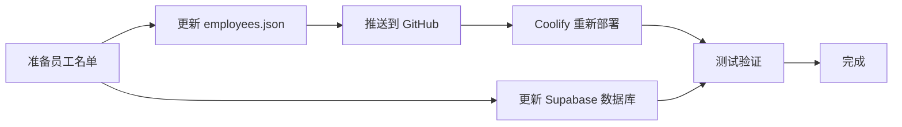

# 员工名单更新指南

## 📋 概述

更新员工名单需要同时修改两个地方：
1. **代码文件**：`lib/employees.json`（用于登录验证）
2. **数据库**：Supabase `employees` 表（用于数据关联）

---

## 🔄 完整更新流程

### 步骤 1：更新代码中的员工名单

#### 1.1 编辑 `lib/employees.json`

```json
{
  "employees": [
    "张伟",
    "李娜",
    "王芳",
    "刘强",
    "陈静"
  ]
}
```

**注意事项：**
- ✅ 使用双引号
- ✅ 每个名字后面加逗号（最后一个除外）
- ✅ 名字必须与数据库完全一致
- ✅ 区分大小写

#### 1.2 推送到 GitHub

```bash
git add lib/employees.json
git commit -m "update: 更新实际员工名单"
git push
```

#### 1.3 在 Coolify 重新部署

1. 登录 Coolify
2. 找到 canovo3d 应用
3. 点击 "Redeploy"
4. 等待部署完成（3-5 分钟）

---

### 步骤 2：更新 Supabase 数据库

#### 方法 1：SQL 批量插入（推荐）

1. **登录 Supabase**
   - 访问：https://supabase.com
   - 选择您的项目

2. **打开 SQL Editor**
   - 左侧菜单 → "SQL Editor"
   - 点击 "New query"

3. **执行 SQL 语句**

```sql
-- 清空现有测试数据（可选，谨慎使用！）
DELETE FROM employees;

-- 插入实际员工名单
INSERT INTO employees (employee_name) VALUES
('张伟'),
('李娜'),
('王芳'),
('刘强'),
('陈静'),
('赵敏'),
('孙浩'),
('周杰'),
('吴磊'),
('郑爽');

-- 验证插入结果
SELECT * FROM employees ORDER BY employee_name;
```

4. **点击 "Run" 执行**

---

#### 方法 2：CSV 批量导入

##### 2.1 准备 CSV 文件

创建 `employees.csv`：

```csv
employee_name
张伟
李娜
王芳
刘强
陈静
赵敏
孙浩
周杰
吴磊
郑爽
```

##### 2.2 在 Supabase 导入

1. 打开 Supabase Table Editor
2. 选择 `employees` 表
3. 点击 "Insert" → "Import data from CSV"
4. 上传 CSV 文件
5. 确认导入

---

#### 方法 3：手动逐个添加

1. 打开 Supabase Table Editor
2. 选择 `employees` 表
3. 点击 "Insert row"
4. 填写 `employee_name`
5. 点击 "Save"
6. 重复步骤 3-5

---

## 📊 批量生成 SQL 工具

### Excel/Google Sheets 公式

如果您有 Excel 员工名单，可以用公式生成 SQL：

**A 列：员工姓名**
```
张伟
李娜
王芳
```

**B 列：生成 SQL（公式）**
```excel
="('"&A1&"'),"
```

**结果：**
```sql
('张伟'),
('李娜'),
('王芳'),
```

复制结果，粘贴到 SQL 语句中。

---

## ✅ 验证更新

### 验证代码更新

访问应用登录页面，尝试输入新员工姓名，应该能通过验证。

### 验证数据库更新

在 Supabase SQL Editor 执行：

```sql
-- 查看所有员工
SELECT * FROM employees ORDER BY employee_name;

-- 统计员工数量
SELECT COUNT(*) as total_employees FROM employees;
```

---

## ⚠️ 重要注意事项

### 1. 名字一致性

**代码和数据库中的名字必须完全一致：**
- ✅ 正确：`张伟` = `张伟`
- ❌ 错误：`张伟` ≠ `张 伟`（有空格）
- ❌ 错误：`张伟` ≠ `张伟 `（末尾空格）

### 2. 不要删除已有数据

如果员工已经上传了照片或模型，**不要删除**该员工记录，否则会导致数据丢失。

**安全做法：**
```sql
-- 只添加新员工，不删除旧数据
INSERT INTO employees (employee_name) VALUES
('新员工1'),
('新员工2');
```

### 3. 测试建议

1. **先添加 1-2 个测试员工**
2. **测试登录和上传功能**
3. **确认无误后再批量添加**

---

## 🔄 更新后的工作流程



---

## 📝 示例：完整 SQL 语句模板

```sql
-- ========================================
-- Canovo 3D 礼品系统 - 员工名单更新
-- 更新日期：2026-01-XX
-- ========================================

-- 1. 查看当前员工（备份用）
SELECT * FROM employees;

-- 2. 清空测试数据（可选，生产环境谨慎使用！）
-- DELETE FROM employees;

-- 3. 插入实际员工名单
INSERT INTO employees (employee_name) VALUES
('张伟'),
('李娜'),
('王芳'),
('刘强'),
('陈静'),
('赵敏'),
('孙浩'),
('周杰'),
('吴磊'),
('郑爽'),
('钱多多'),
('冯晓'),
('褚健'),
('卫强'),
('蒋丽');

-- 4. 验证插入结果
SELECT COUNT(*) as total_employees FROM employees;
SELECT * FROM employees ORDER BY employee_name;
```

---

## 🆘 常见问题

### Q: 更新后员工无法登录？
**A:** 检查 `employees.json` 和数据库中的名字是否完全一致（包括空格）。

### Q: 需要重启应用吗？
**A:** 
- 更新 `employees.json` 后：需要在 Coolify 重新部署
- 更新数据库后：不需要重启，立即生效

### Q: 如何批量删除员工？
**A:** 
```sql
-- 删除特定员工
DELETE FROM employees WHERE employee_name IN ('测试员工1', '测试员工2');

-- 删除所有员工（危险！）
DELETE FROM employees;
```

### Q: 员工名单有重复怎么办？
**A:** 
```sql
-- 查找重复
SELECT employee_name, COUNT(*) 
FROM employees 
GROUP BY employee_name 
HAVING COUNT(*) > 1;

-- 删除重复（保留一个）
DELETE FROM employees 
WHERE id NOT IN (
    SELECT MIN(id) 
    FROM employees 
    GROUP BY employee_name
);
```

---

## 📞 技术支持

如遇问题，请检查：
1. ✅ `employees.json` 格式是否正确
2. ✅ GitHub 代码是否已推送
3. ✅ Coolify 是否已重新部署
4. ✅ Supabase 数据是否已插入
5. ✅ 名字拼写是否完全一致

---

**最后更新：** 2026-01-05
